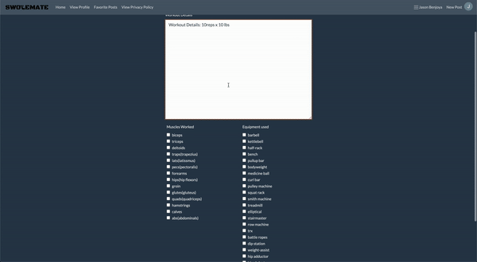
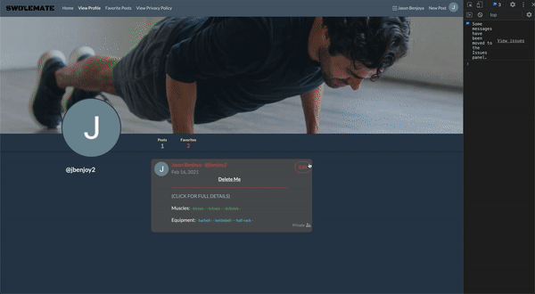

# Swolemate - Capstone Project by Jason Benjoya 
## Live demo: https://jb-swolemate.herokuapp.com/
---

<p align="center">


</p>

### PROJECT GOALS
   This project was my first fully built-from-scratch Full-Stack web application, using all of the technologies learned up to this half-way point in the Springboard Software Engineering Career Track. ```Swolemate``` was created using the following technologies:

   * HTML5
   * CSS3
   * Javascript
   * JQuery
   * Bootstrap
   * AJAX/Axios
   * Python
   * Flask
   * Jinja
   * PostgreSQL
   * SQLAlchemy
   * WTForms
   * BCrypt

   **Note**: *This is a first version of a student project. Therefore, while there are many features that could be built out further, this app is merely a first step to show my understanding of the technologies at play.*
   ___


### ABOUT THE APP
   Swolemate is a platform for users to view and share their home workouts in the time of closed gyms and working from home. Many people get so discouraged with their ability, or lack thereof, to workout and stay healthy while at home. Swolemate aims to give people the ability to better decide what workouts they can do based on their level of comfort and knowledge.

   There are two types of users of this app, a "poster" and an "observer". Swolemate presents itself as a low-level social media platform, and therefore some users will be avidly posting every workout they complete, and some will choose to use other user posts as motivation for their own fitness endeavors without actually posting anything. 
   ___
### USER FLOW
#### <ins>Authentication</ins>
   While full use of all Swolemate's features does require authentication, an unauthenticated user does have some limited access, where they can view minor details of public posts, as seen below:
   

   A user can log in by clicking on the "Log In" button in the top right corner in the Navbar, which will open a modal to either log in with a username/password combination, or use Google authentication to log in with their Google credentials. 

   

   **NOTE**: *If a user chooses to log in using Google, and does not already have an account associated with their gmail email address, they will be asked to create a unique username and a password for their account, and their gmail email address will be stored in the database for future login. Otherwise, they will simply be logged in to the site and taken to their home page.*

   

   A user can also choose to sign up for an account, free of charge, using an email/password combination, along with their full name, a unique username, and an optional profile picture (from a provided url) and cover photo(from a provided url). If either photo URL is left blank, the default images will be used. 

    

   Once authenticated, a user is taken to their own home page, where they can see any post, whether it is marked as public or private, and have access to full details of those posts by clicking on them. They also have the ability to mark posts as favorites, create their own posts, or view and edit their profile. 

    

   ##### ```Password Encryption```
   All user passwords are salted and encrypted using the Flask-BCrypt module before being stored in the database. This provides an added level of security for users, so that they can be assured that nobody else knows their password.

   #### <ins>Posts</ins>
   Much of the inspiration of the UI for Swolemate came from Twitter, with some small differences. There is no 'follow' functionality, so all user posts will be accessible from the home page. Furthermore, full post details are hidden on their own page on a post-by-post basis to keep the home page more uniform, as some workout details may be significantly longer than others.

   

   Posts are made up of a Title, a 'details' section where users can be as detailed as they want to about the exact workouts they performed, weight amounts used, sets and reps, etc., a selection of muscles worked, and a selection of equipment utilized. All of these fields are required, because without them a workout post would be lacking essential information. There is also an option "Make this workout private" checkbox, which when checked will disallow anauthenticated users from being able to see any aspect of it from the unauthenticated home page. This option does not, however, remove it from the home page of authenticated users (this is explained using a 'help' popover, as well). 

   Once a post is successfully created, a user is brought to his or her profile, where they can see their own posts, as well as any post they have marked as a favorite. 

   

   Any post that has been created by a user will present on his or her profile page with an "edit" button, which will allow them to edit any and all aspects of that post. After submitting an edit, a user is brought to the full details page of that post. 

   
  


   ##### ```Favoriting/unfavoriting a Post```
   On a post details page, clicking the star icon will add that post to a user's favorites and will navigate a user to his or her favorites page. Clicking the star icon again on any favorited post will remove that post from a user's favorites and pull it from their favorites page at the same time. 
   
   
   ##### ```Deleting a Post```
   On a post edit form, a user can also choose to delete the post he or she is editing. If the "Delete" button is clicked, a modal is launched to confirm the choice. Once the post is deleted, it is removed from the database, and from the favorites list of any user who had favorited the post prior to deletion. 
   
___

### API Usage
 - https://wger.de/api/v2/ - used for their data as a reference but not directly to ping
 - https://developers.google.com/identity/sign-in/web - used to ping for auth

 This app, being a social media app of sorts, doesn't actually directly utilized an external API for data. As noted above, the wger API was used as a starting point for me to seed my own database with the muscles and equipment, but it was not all encompassing (and it was in German). 

 I do, however, directly ping the Google API for their sign-in functionality. 

 Due to a lack of external data, I use Axios/AJAX to ping my own back-end for pagination purposes.
#### <ins>Pagination</ins>

As an included feature of my front end, I utilized Flask-SQLAlchemy's `Paginate()` method to create ten-post-long pages out of all of my posts. This way, a user's home page is not continuously scrolling and overloaded with posts. A future version may include an infinite scroll functionality, but for now, a "Load More" button is being used instead to trigger the fetching of the next page. In order to make this work properly, I set up a single route on my back-end to be an API route for the front-end to ping using Axios, with the response including the page of posts, and a property describing whether another page exists after the current one. 

 
___
### Methods Utilized

When loading the posts on the front end using the API pagination route, the mark-up added per post varied depending on whether the user was logged in or not, and whether the post was marked private or public. Private posts don't show up at all if a user is not logged in, so those were not fetched on the back-end if there was no user authenticated in the session. Furthermore, private posts have icons that denote them as such, and therefore two different markup variations had to be used for public and private posts, respective if there *was* an authenticated user in the session. Therefore, different javascript files exist for authenticated users vs anonymous users (they can be found in the `/staic/javascript` folder). 

Within the authenticated javascript file, different markup exists for private vs public posts, as well. Each markup is rendered using a helper function depending on whether a post has the "is_private" property set to true or not.  


___
## <ins>Running the app</ins>
To run the app locally on your machine, complete the following steps:

1. Download and install the latest stable version of PostgreSQL for your operating system [here](https://www.postgresql.org/download/)
2. Once installed, open your terminal (or other bash command line tool) and ensure that the `psql` command is working and launches the PostgreSQL CLI. If not, install the `psql` command in your PATH. 
3. Once `psql` is confirmed to be working, use it to access the PostgreSQL CLI and run the following command:
    ```SQL
        CREATE DATABASE swolemate;
    ```
4. Clone this Github Repository to your machine into a new folder that is not already a git repository. 
5. In that parent folder, run the following commands to create a python virtual environment, install all requirements, and start a flask server:
   ```bash
      $ python3 -m venv venv
      $ source venv/bin/activate
      $ pip3 install -r requirements.txt
      $ export FLASK_ENV=development
      $ flask run
   ```
6. In your browser, type in the URL that is displayed in your terminal window after running the final command above. 


## <INS>IMPORTANT NOTE: GOOGLE AUTH</INS> 
In order to properly utilize the google authentication API, you will need to register (free of charge) for a google developer account and register an app for OAuth2 credentials. (For more help on this, click [here](https://developers.google.com/identity/protocols/oauth2))

Once you have your clientID and secret key, create a file called `google_auth.py` in the root project directory, and in it write the following:

   ```python
      from authlib.integrations.flask_client import OAuth

      id = <your-client-id-here>
      secret = <your-secret-key-here
   ```     
___
## Running Tests

A comprehensive test suite is included above in the tests folder. Tests are written using python's `Unittest` module. The tests can be run two different ways.

1. VSCode (recommended)
    - From within VSCode, open the command palette (`SHIFT` + `CMD` + `P` on mac, `SHIFT` + `CTRL` + `P` on Windows)
    - Type `Python: configure tests` and choose `unittest` from the dropdown.
    - select `tests` as the test directory from the dropdown
    - select `test_*.py` from the dropdown.
    - From the VSCode side navigation bar, click the button that looks like a chemistry flask 
    
        

    - Hit the two sideways arrows to run all tests in the test suite. 
2. From the command line
   - In order to run tests from the command line, they cannot be in a subdirectory. Therefore, start by moving all test files out of the `tests` directory and into the root project directory (same level as your `models.py` file)
   - At the command line, navigate to the folder that now contains all tests, and run the following command:
        ```bash
           python3 -m unittest <test_file_name.py>
        ```
      - The above command will run one test file at a time, depending on what filename is supplied 

